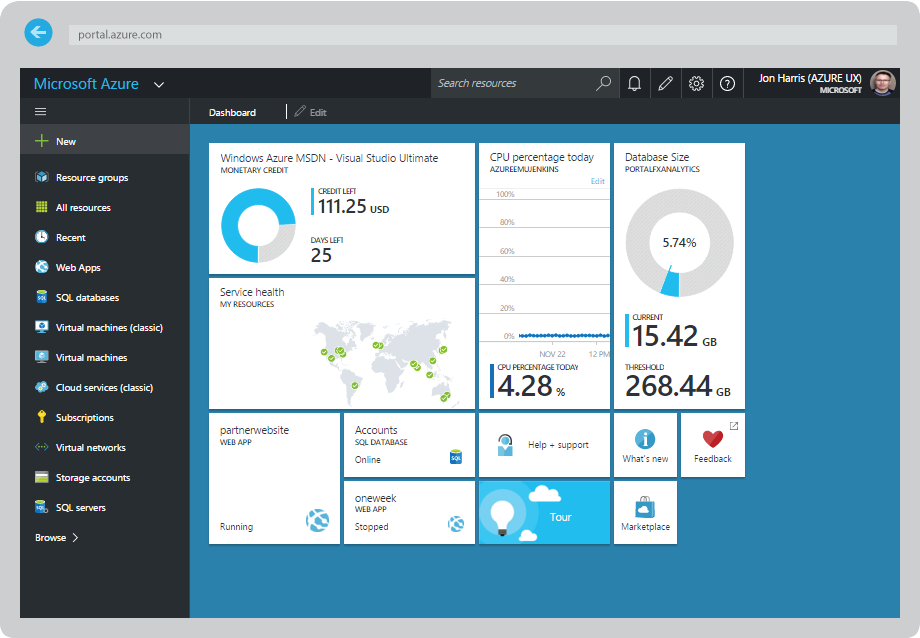
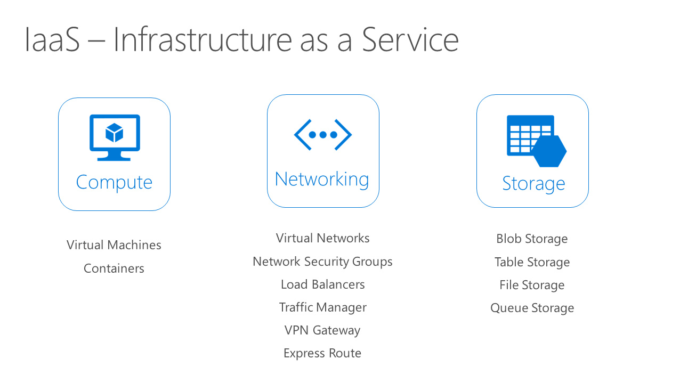

# Azure Quickstart
Resources to get started quickly on Microsoft's cloud platform.

## Getting Started

- [Interactive Azure Map](https://aka.ms/azmap) - Explore this interactive overview of services available on the Azure platform, grouped by type. Click on service names to learn about them and get links to get started.
- [Azure Learning Paths](https://azure.microsoft.com/en-us/documentation/learning-paths/) - Get started with these learning paths for different Azure Services.

## Working with Azure

- [Azure Portal](https://portal.azure.com) - The best way to get started is with the Azure portal, a web based interface for managing Azure.
- [Azure SDKs & Tools](https://azure.microsoft.com/en-us/downloads/) - SDKs for many common languages such as .NET, Java, Node.js, Python, Ruby and other tools.
- [Azure PowerShell](https://msdn.microsoft.com/en-us/library/jj156055.aspx) - Work with PowerShell cmdlets to perform Azure operations.
- [Azure CLI](https://azure.microsoft.com/en-us/documentation/articles/xplat-cli-install/) - For Linux, Mac or Windows. Installs via npm package manager.
- [Azure API Reference](https://msdn.microsoft.com/en-us/library/azure/mt420159.aspx) - Reference for Azure REST and .NET APIs.
- [Azure Resource Explorer](http://resources.azure.com/) - A very useful web application to explore the Azure REST API.
- [Azure Storage Explorer](http://storageexplorer.com/) - A client application for Linux, Mac or Windows to easily work with storage accounts on Azure. 

## Azure Resource Manager (ARM)
The Azure Resource Manager is at the core of the Azure platform and is used to deploy and manage Azure services. Every resource in Azure managed under ARM can be described and managed in a consistent way. It's very helpful to understand the Azure Resource Manager and how to work with Resource Groups.
> Azure has two different deployment models for creating and working with resources: Resource Manager and classic. Microsoft recommends that most new deployments use the Resource Manager model. 

- [ARM Overview](https://azure.microsoft.com/en-us/documentation/articles/resource-group-overview/) - Get an overview of the Azure Resource Manager
- [ARM vs. Classic](https://azure.microsoft.com/en-us/documentation/articles/resource-manager-deployment-model/) - Understand the difference between ARM the Classic (ASM) deployment model.

### ARM Templates
ARM templates are JSON descriptions of ARM deployments which can be used for "Infrastructure as Code".
- [Deploying ARM Templates](https://azure.microsoft.com/en-us/documentation/articles/resource-group-template-deploy/) - With PowerShell, Azure CLI or REST API.
- [Quick Start Templates](https://github.com/Azure/azure-quickstart-templates) - A Github maintained, vast collection of templates for common use cases to help you get started authoring your own templates or deploying simple solutions.
- [Template Authoring](https://azure.microsoft.com/en-us/documentation/articles/resource-group-authoring-templates/) - How to author custom templates.

## Infrastructure Services

### Compute

### Networking
### Storage

## Platform as a Service (PaaS)
### Azure App Service
### Azure SQL
### DocumentDB

## Azure Marketplace

## Cloud Architecture
- [Cloud Patterns & Practices](https://aka.ms/mspnp) - Best practices for building cloud solutions. Including checklists and design patterns. 
- [Architecture Blueprints](https://msdn.microsoft.com/architects-blueprints-msdn) - Architectures for an array of different cloud scenarios.

## Additional Useful Tools & Links
- [AWS/Azure mapping](https://azure.microsoft.com/en-us/campaigns/azure-vs-aws/mapping/) - 
- [Azure Price Calculator]( https://aka.ms/azurecalc) - Easily calculate pricing of Azure Services
- [Azure Trust Center](https://azure.microsoft.com/en-us/support/trust-center/) - Learn about Azure security, compliance, privacy and transparency. 